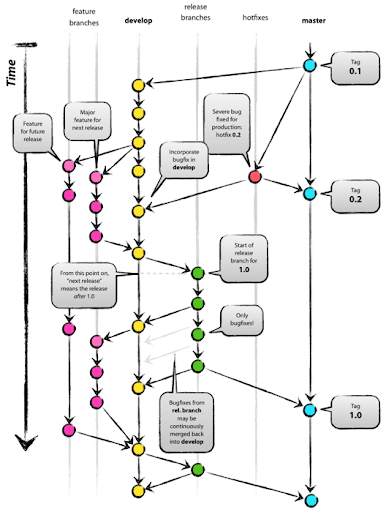

### Description

- Combine des éléments de Git Flow et Github Flow avec des environnements specifiques (production, staging, test,...).

##### Branches princpales

- **main**
- **develop**
- **Branche d'environnement**: production, pre-prod,...

- **Avantage**: adapté pour les environnements multiples et processus de validation.
- **Inconvénients**: Complexe à mettre en place

